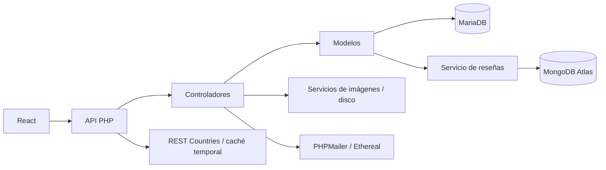

# Arquitectura y directorios

React solicita JSON a endpoints PHP independientes. Los endpoints comprueban método/sesión/permisos; los controladores validan reglas; los modelos consultan datos; los servicios resuelven MongoDB, archivos y correo. No hay framework PHP ni router único de backend.

## Directorios propios

| Ruta | Responsabilidad y referencia |
| --- | --- |
| `api/` | Entradas HTTP y respuestas compartidas; [API](API_RECURSOS.md). |
| `api/auth/` | Login, registro, logout y sesión. |
| `api/admin/`, `api/cuenta/` | [Administración](CRUD_ADMINISTRACION.md) y [panel personal](PANEL_USUARIO.md). |
| `api/catalogo/`, `api/checkout/` | Catálogo público y [compra](CATALOGO_CHECKOUT.md). |
| `api/paises/` | [Proveedor y caché](PAISES.md); muestra auxiliar descrita en [utilidades](UTILIDADES.md). |
| Resto de `api/` | Categorías, productos, usuarios, proveedores, promociones, direcciones, órdenes, pagos, facturas, devoluciones, reseñas y wishlist; [contratos](API_RECURSOS.md). |
| `app/controllers/` | Validación, reglas de negocio y transacciones. |
| `app/models/` | Consultas PDO, sesión, cuenta, catálogo y enlace de reseñas. |
| `app/services/` | `CorreoPedido.php`, `ResenasMongo.php`, `ImagenProducto.php`, `ImagenesResena.php`; guías de checkout, reseñas e imágenes. |
| `config/` | Conexiones, configuración privada y rutas de cargas; [instalación](INSTALACION_LOCAL.md). |
| `database/` | SQL, dump, preparación de índices y actualización de imágenes; [datos](BASE_DATOS.md). |
| `database/csv/`, `database/json/` | Datos de demostración y exportaciones; [formato JSON](../database/json/README.md). |
| `docs/` | Documentación; [índice](README.md). |
| `frontend/` | React, manifiestos, Vite y ESLint; [guía frontend](../frontend/README.md). |
| `frontend/src/pages/` | Inicio, cuenta, checkout y paneles. |
| `frontend/src/components/` | Formularios, tarjetas, navegación, tablas y vistas. |
| `frontend/src/context/` | Autenticación y hooks de catálogo, carrito y deseos. |
| `frontend/src/services/` | Peticiones HTTP, formato y recuperación de compra. |
| `frontend/src/data/` | Esquemas y navegación administrativa/personal; datos auxiliares. |
| `frontend/src/styles/`, `frontend/src/js/` | SCSS e interacciones globales; también hay CSS en `src/`. |
| `frontend/public/`, `frontend/public/productos/` | Favicon y fotografías, incluidas cargas; [imágenes](IMAGENES_PRODUCTOS.md). |
| `public/` | Herramientas PHP auxiliares y cargas; [utilidades](UTILIDADES.md). |
| `public/uploads/`, `public/uploads/resenas/` | Fotografías persistentes del backend; [reseñas](RESENAS_MONGODB.md). |
| `tests/` | Suites, módulos de casos, fixtures, capturas y utilidades; [pruebas](CASOS_PRUEBA.md). |

## Dependencias y salidas

| Ruta | Tratamiento |
| --- | --- |
| `vendor/` | Dependencias PHP; entrada `autoload.php`. |
| `vendor/composer/` | Autocarga, metadatos y comprobación de plataforma. |
| `vendor/mongodb/`, `vendor/phpmailer/`, `vendor/psr/`, `vendor/symfony/` | MongoDB, correo, interfaces y compatibilidad; código de terceros. |
| `frontend/node_modules/` | Dependencias JavaScript instaladas. |
| `frontend/dist/` | Compilación regenerable, distinta del `build` raíz. |
| `tests/__pycache__/` | Caché Python. |
| Directorio temporal PHP | Caché de países, fuera del proyecto. |

Los manifiestos/lockfiles de raíz y frontend controlan dependencias y tareas. `.gitignore` es metadato heredado, no evidencia de un repositorio activo. `.htaccess` depende de Apache. No editar dependencias para personalizar la aplicación; no hace falta documentar individualmente cada archivo interno de terceros. `INFORME` y `build` están excluidos.

## Rutas y persistencia

| Ruta | Pantalla |
| --- | --- |
| `/` | Inicio, búsqueda y filtros por parámetros. |
| `/checkout`, `/checkout?pedido=TOKEN` | Compra y confirmación propia. |
| `/cuenta` | Registro/login o paneles. |
| `/cuenta/usuario/:seccion` y `/:id` | Perfil, direcciones, órdenes, deseos, reseñas y devoluciones. |
| `/cuenta/admin/:recurso` y `/:operacion` | Gestión administrativa. |
| Otras | Página no encontrada. |

localStorage conserva ID/cantidad del carrito; sessionStorage guarda el intento de compra por usuario. La autenticación depende de sesión PHP y los permisos se comprueban en backend. MariaDB conserva operaciones; Atlas guarda reseñas; las imágenes están en disco.

[Volver al índice documental](README.md).
