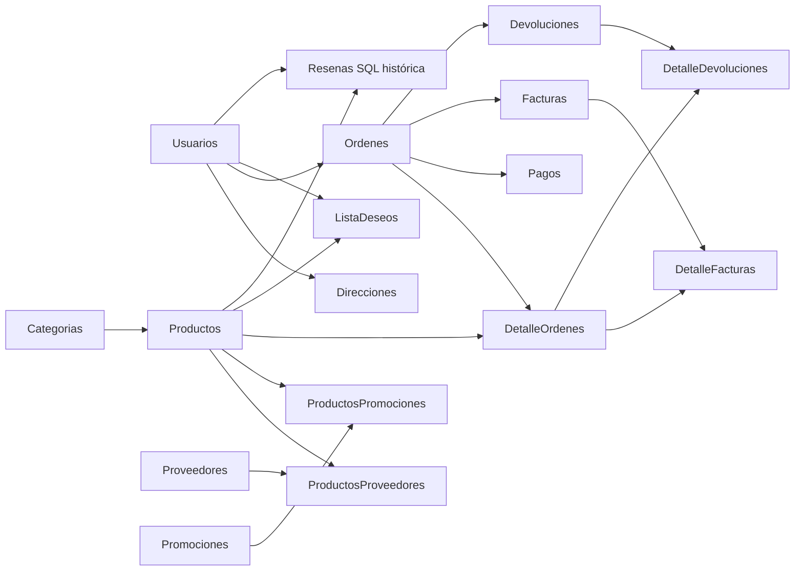

# Bases de datos y archivos de datos

MariaDB conserva datos transaccionales. Atlas almacena las reseñas activas y el contador de identificadores. UsuarioID/ProductoID relacionan ambos motores; no hay claves foráneas ni transacciones distribuidas entre ellos.

## Modelo relacional

El esquema está en [crear_bd_tablas.sql](../database/crear_bd_tablas.sql), con 17 tablas. Se mantiene PascalCase para la aplicación local; no se aplican aquí los cambios de hosting/Linux.

| Tabla | Finalidad |
| --- | --- |
| Usuarios | Identidad, hash, rol y estado de cuentas. |
| Direcciones | Direcciones pertenecientes a usuarios. |
| Categorias | Jerarquía mediante CategoriaPadreID. |
| Proveedores | Contactos y datos del proveedor. |
| Productos | Categoría, precio, existencias e imagen. |
| Promociones | Descuentos, vigencias y condiciones. |
| ProductosProveedores | Relación producto/proveedor con clave compuesta. |
| ProductosPromociones | Relación producto/promoción con clave compuesta. |
| Ordenes | Pedido, propietario y direcciones históricas. |
| DetalleOrdenes | Productos, cantidades e importes del pedido. |
| Pagos | Registros internos de pago de órdenes. |
| Facturas | Documento interno de la orden. |
| DetalleFacturas | Líneas vinculadas a detalles de orden. |
| Devoluciones | Solicitudes sobre órdenes entregadas. |
| DetalleDevoluciones | Cantidades por detalle de orden. |
| ListaDeseos | Relación usuario/producto con clave compuesta. |
| Resenas | Copia histórica SQL; las reseñas activas están en MongoDB. |

El diagrama resume dependencias; tipos, índices y acciones de borrado se consultan en el SQL. `docs/Diagrama_EER.pdf` no está presente y no se considera evidencia incluida.

## Archivos y preparación

| Recurso | Uso |
| --- | --- |
| [todoaqui_db.sql](../database/todoaqui_db.sql) | Dump de estructura/datos del 25/09/2026; instantánea, no base viva. |
| [crear_bd_tablas.sql](../database/crear_bd_tablas.sql) | Crea base/tablas; no es una migración idempotente sobre tablas existentes. |
| [cargar_datos.sql](../database/cargar_datos.sql) | `LOAD DATA LOCAL INFILE` desde CSV. Sus rutas apuntan a `proyecto-desarrollador-full-stack`; adaptar una copia antes de ejecutarlo. |
| `database/csv/` | Datos de demostración originales de 17 tablas. |
| `database/json/` | Exportaciones Extended JSON; véase [formato](../database/json/README.md). |
| [imagenes_productos.json](../database/imagenes_productos.json) | ID/SKU, rutas anteriores/nuevas y fuentes de imágenes. |
| `actualizar_imagenes_productos.php` | Verifica/aplica/revierte rutas de imagen. |
| `preparar_resenas_mongo.php` | Crea índices y prepara contador de reseñas. |

En una máquina nueva elegir **una** alternativa, sobre una base vacía:

1. Crear/seleccionar la base en phpMyAdmin e importar el dump. No cargar CSV además.
2. Ejecutar el esquema y cargar una copia del script CSV con rutas adaptadas, usando cliente/servidor con `LOCAL INFILE` habilitado. Revisar recuentos y advertencias.

Antes de importar, revisar nombres y sentencias `USE`, conservar los datos existentes y seleccionar el destino correcto. El dump y los CSV pueden corresponder a estados diferentes. No reflejan automáticamente compras posteriores. La conexión PDO debe apuntar a la base elegida.

Importar SQL no prepara Atlas. Seguir [Reseñas](RESENAS_MONGODB.md) para MongoDB. Los JSON de Usuarios/Productos no se sincronizan con MariaDB.

## Integridad y conservación

BCMath calcula importes; transacciones y bloqueos coordinan existencias y documentos. Las [reglas de API](API_RECURSOS.md) detallan estados y restricciones. Las referencias de reseñas MongoDB deben conservarse; la tabla histórica SQL puede imponer restricciones adicionales.

Respaldar MariaDB, MongoDB y fotografías; una copia SQL no incluye Atlas ni archivos. No se ejecutó ninguna importación ni modificación de datos durante esta revisión documental.

[Volver al índice documental](README.md).
